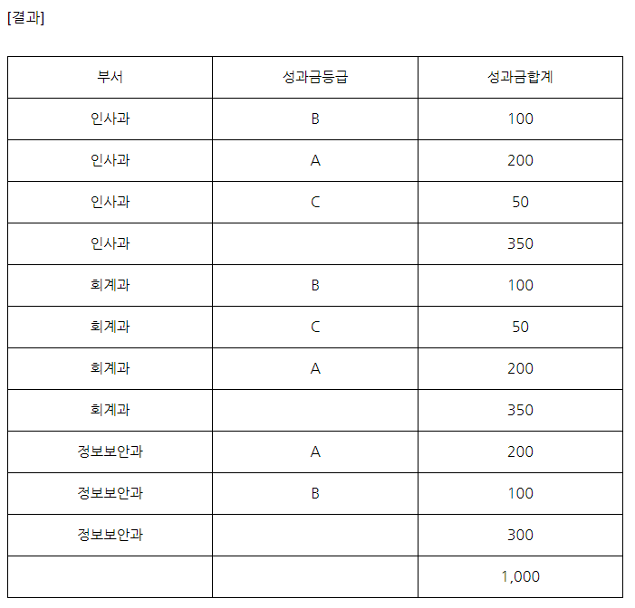

## 아래는 데이터 통신을 사용하여 인터페이스를 구현하는 방법이다. 괄호(     ) 안에 들어갈 용어를 쓰시오.
- 인터페이스 객체를 생성하기 위해서 데이터베이스에 있는 정보를 SQL을 통하여 선택한 후 이를 속성-값(Attribute-Value Pair) 쌍 또는 “키-값 쌍”으로 이루어진 데이터 오브젝트를 전달하기 위해 인간이 읽을 수 있는 텍스트를 사용하는 개방형 표준 포맷 (        ①        )으로 생성한다.
- 송신 측에서 (        ①        )으로 작성된 인터페이스 객체를 자바스크립트를 사용하는 비동기 통신기술이자, 클라이언트와 서버 간에 XML 데이터를 주고받는 (        ②        )기술을 이용하여 수신 측에 송신한다.
- 수신 측에서는 (        ①        ) 인터페이스 객체를 수신받고 이를 파싱 후 처리한다.
- 수신 측의 처리 결괏값은 송신 측에 True / False 값을 전달하여 인터페이스 성공 여부를 알 수 있게 한다.

```정답)```  
① JSON(Javascript Object Notation) (=제이슨)  
② AJAX(Asynchronous Java Script and XML)  

## 82. 다음은 보안 공격 기법에 대한 설명이다. 괄호 ( ) 안에 들어갈 가장 정확한 보안 공격 기법을 쓰시오. 
- (       ①       ) : 검증되지 않은 외부 입력 데이터가 포함된 웹페이지가 전송되는 경우, 사용자가 해당 웹페이지를 열람함으로써 웹페이지에 포함된 부적절한 스크립트가 실행되는 공격기법
- (       ②       ) : 응용 프로그램의 보안 취약점을 이용해서 악의적인 SQL 구문을 삽입, 실행시켜서 데이터베이스(DB)의 접근을 통해 정보를 탈취하거나 조작 등의 행위를 하는 공격기법
- (       ③       ) : 사용자가 자신의 의지와는 무관하게 공격자가 의도한 행위(수정, 삭제, 등록 등)를 특정 웹사이트에 요청하게 하는 공격기법


정답)  
① XSS(Cross Site Scripting)  
② SQL Injection  
③ CSRF(Cross-Site Request Forgery)  


## 다음은 고객 테이블이다. 나이가 40살 이상이면서 60살 이하이고, 성별이 남자인 사람의 이름을 출력하는 쿼리를 작성하시오. (단, BETWEEN 구문을 사용해야 한다.)
* 
```sql
SELECT 이름
   FROM 고객
 WHERE 나이 BETWEEN 40 AND 60
   AND 성별 = '남';
```

## 실행 결과
*   
```보안```
- group by 를 이용하여 과목별로 건수(count)를 집계한 후, 과목의 건수가 1보다 큰 데이터만 추출합니다.
- MariaDB [test2]> select 과목, count(과목)
-> from 성적
-> group by 과목
-> having count(과목) > 1;  
*   
- 위 결과를 다시 select 명령으로 과목만 추출합니다.

## C
```c
#include <stdio.h>
void main(){
   int a[5] = {3, 4, 1, 2, 0};
   printf("%d %d", a[a[4]], a[3]+a[1]);
}
```
정답) 3 6

## 53. 기관 간 인터페이스 연계 시에는 데이터 보호를 위한 적절한 보안 프로토콜 적용이 필요하다. 아래는 인터페이스 연계 시 적용할 수 있는 보안 프로토콜에 대한 설명이다. 괄호 ( ) 안에 들어갈 가장 올바른 보안 프로토콜을 쓰시오.
- ( ① ) : 전송계층(4계층)과 응용계층(7계층) 사이에서 클라이언트와 서버 간의 웹 데이터 암호화(기밀성), 상호 인증 및 전송 시 데이터 무결성을 보장하는 보안 프로토콜
- ( ② ) : 웹 상에서 네트워크 트래픽을 암호화하는 주요 방법 중 하나로 클라이언트와 서버 간에 전송되는 모든 메시지를 각각 암호화하여 전송하는 보안 프로토콜
정답) 
① SSL/TLS 또는 SSL 또는 TLS
② S-HTTP(Secure Hypertext Transfer Protocol)
해설)
- 2021 수제비 실기책 9-24
- S-HTTP는 EIT에서 제안한 www에서 보안을 강화할 수 있도록 구성된 메시지 기반 프로토콜
 --> HTTP 세션으로 주고받는 자료에 대한 암호화, 전자서명 지원, 보안기능 제공
 
 ## 20. [성과금] 테이블의 '부서', '성과금등급', '성과금'에 대해서 부서별 소계와 전체 합계를 검색하는 SQL 구문을 작성하시오.
[조건]
- [성과금] 테이블의 속성에는 부서, 성과금등급, 성과금이 있다.
- 속성명은 '성과금합계'로 하고, ROLLUP 함수를 사용한다.  
*   
정답)
SELECT 부서, 성과금등급, SUM(성과금) AS 성과금합계
FROM 성과금
GROUP BY ROLLUP(부서, 성과금등급);

## 16. [학과] 테이블에서 ‘교수명’의 이름이 “황”으로 시작하는 튜플의 ‘학과번호’를 777로 업데이트하는 SQL 구문을 작성하시오.
* 

정답)  
```
UPDATE 학과  
SET 학과번호 = 777  
WHERE 교수명 LIKE ‘황%’;  
```

## 15. [결제]테이블을 이용해서 결제유형별 입장객수를 검색하는 SQL문을 쓰시오. 단, 결제 테이블 속성에는 결제일, 결제유형, 결제금액이 있다.
[조건]
* 테이블명은 결제이다.
* 별칭은 입장객수로 쓴다.
* 문장의 끝에는 세미콜론(;)을 표기한다.  
*  
정답)
```
SELECT 결제유형, COUNT(*) AS 입장객수
FROM 결제
GROUP BY 결제유형;
```

## 아래의 쿼리를 실행했을 때, 튜플의 수는 얼마인지 쓰시오.
```
CREATE TABLE TBB1 ( NAME VARCHAR2(20), AGE NUMBER(3) ); 
CREATE TABLE TBB2 ( NAME VARCHAR2(20), AGE NUMBER(3) );
INSERT INTO TBB1(NAME, AGE) VALUES('장씨', 30);
INSERT INTO TBB1(NAME, AGE) VALUES('마씨', 35);
INSERT INTO TBB1(NAME, AGE) VALUES('홍씨', 40);
INSERT INTO TBB1(NAME, AGE) VALUES('남씨', 40);
INSERT INTO TBB2(NAME, AGE) VALUES('장씨', 30);
INSERT INTO TBB2(NAME, AGE) VALUES('이씨', 50);
INSERT INTO TBB2(NAME, AGE) VALUES('최씨', 55);
SELECT * FROM TBB1
UNION
SELECT * FROM TBB2;
```
정답) 6 
* 

## 11. 데이터베이스 관리자가 권한을 부여하는 DCL 문을 작성하시오.
• 관리자가 인사담당자 고길동에게 ‘직원’ 테이블에 대해 INSERT할 수 있는 권한을 부여
• 대소문자를 구분하지 않음
정답) GRANT INSERT ON 직원 TO 고길동;

## 10. 학생 테이블을 이용하여 아래 결과가 나올 수 있도록 SQL 문을 작성하시오.
(조건)  in을 사용하여 1, 4학년 출력
* 
```
SELECT 이름, 학년, 점수, 과목
FROM 학생
WHERE 학년 IN (1, 4);
```

## 8. 다음 '교수' 테이블을 생성하는 SQL문에서 전공과목의 속성값을 '물리학', '심리학'으로 제한하고자 한다. ①, ②에 들어갈 SQL 구문을 쓰시오.
```sql
CREATE TABLE 교수
(교수번호 NUMBER NOT NULL,
교수명 CHAR(12),
전공과목 CHAR(15) ① (전공과목 ② ('물리학', '심리학')));
```

정답)  
① CHECK  
② IN  