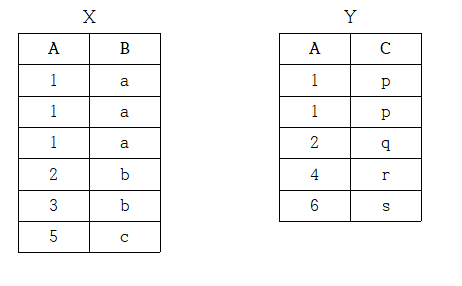

## C 포인터 &
```c
## include <stdio.h> 
int main() 
{ 
    char sTemp[16] = "Hello Sujebi"; 
    printf("%s", &sTemp[6]); 
    return 0; 
}
&는 주소 포인터 배열 6번 부터 출력됨
sTemp의 7번째( array는 0부터시작) 값인 'S' 부터 문자열의 끝까지 출력합니다.
sTemp[0]='H'     //1번째
sTemp[1]='e'     //2번째
sTemp[2]='l'      //3번째
sTemp[3]='l'     //4번쨰
sTemp[4]='o'     //5번째
sTemp[5]=' '      //6번째
sTemp[6]='S'     //7번째
sTemp[7]='u'
sTemp[8]='j'
sTemp[9]='e'
sTemp[10]='b'
sTemp[11]='i'
```
## 다음 두 릴레이션 X(A, B)와 Y(A, C)가 있을 때, SQL 문을 수행한 후 생성되는 튜플(tuple)의 갯수는?
```
(SELECT DISTINCT A FROM X) UNION ALL (SELECT A FROM Y)
```

- X표에 대해서는 DISTINCT 즉, 중복허용 안되니까 1,2,3,5 4개
- Y표에 대해서는 UNION ALL이니까 중복값 허용해서 1,1,2,4,6 5개
## C atoi
```c
#include <stdio.h>
#include <stdlib.h>  //atoi() 함수 사용하기 위한 헤더파일
int main()
{
    char str[8] = "2021";   // 문자열 "2021"
    int num = atoi(str);    // 문자열을 숫자로 변환
    printf("%d", num * 2);   // 2021(숫자) * 2 한 값을 출력
    return 0;
}
```
atoi는 문자열을 숫자로 변환하는 함수이다.
문자열 "2021"을 숫자 2021로 변환하고 2를 곱한 값을 출력한다.
## '교수' 테이블을 생성하는 SQL문에서 전공과목의 속성값을 '물리학', '심리학'으로 제한하고자 한다. ①, ②에 들어갈 SQL 구문을 쓰시오.
```sql
CREATE TABLE 교수
(교수번호 NUMBER NOT NULL,
교수명 CHAR(12),
전공과목 CHAR(15) ① (전공과목 ② ('물리학', '심리학')));
```
① CHECK
② IN
---
* (        ①       )은/는 만들어진 애플리케이션을 실행하지 않고 분석하는 도구로 대부분의 경우 소스 코드에 대한 코딩 표준, 코딩 스타일, 코드 복잡도 및 남은 결함을 발견하기 위하여 사용한다.
* 반면에 (          ②        )은/는 애플리케이션의 처리량, 응답시간, 경과시간, 자원사용률에 대해 가상의 사용자를 생성하고 테스트를 수행함으로써 성능 목표를 달성하였는지를 확인하는 테스트 자동화 도구이다.
정답  
* ① 정적 분석 도구(Static Analysis Tools)  
* ② 성능 테스트 도구(Performance Test Tools)
---
- 스크리닝 라우터(Screening Router)는 망과 망 사이에 라우터를 설치하고 라우터에 ACL을 구성하는 형태의 장비이고, 베스천 호스트(Bastion Host)는 침입 차단 소프트웨어가 설치되어 내부와 외부 네트워크 사이에서 일종의 게이트 역할을 수행하는 장비이다.
- 또한 (           ①           )은/는 2개의 네트워크 인터페이스(2개의 랜카드)를 가진 베스천 호스트를 이용한 구성으로, 논리적으로만 구분하는 베스천 호스트에 비해서 물리적으로 구분이 있으므로 더 안전한 구성 방식이다.
- 반면에 (           ②           )은/는 스크리닝 라우터 2개 사이에 하나의 서브넷(망)(=DMZ 망)을 구성하고, 서브넷에 베스천 호스트를 적용하는 구성 방식이다.
정답)  
* ① 듀얼 홈드 게이트웨이(Dual Homed Gateway)  
* ​​② 스크린드 서브넷 게이트웨이(Screened Subnet Gateway)
---
- (         ①        )은/는 하나의 프로세스가 CPU를 차지하고 있을 때, 우선순위가 높은 다른 프로세스가 현재 프로세스를 중단시키고 CPU를 점유하는 스케줄링 방식이다.
- (         ②        )은/는 프로세스가 도착하는 시점에 따라 그 당시 가장 작은 서비스 시간을 갖는 프로세스가 종료 시까지 자원을 점유하는 방식으로 기아 현상이 발생할 가능성이 있다.
- 또한 (         ③        )은/는 대기 중인 프로세스 중 현재 응답률(Response Ratio)이 가장 높은 것을 선택하는 방법으로 (         ②        )의 약점인 기아 현상을 보완한 기법으로 긴 작업과 짧은 작업 간의 불평등 완화한 기법이다.

정답)  
① 선점형 스케줄링(Preemptive Scheduling)  
​② SJF(Shortest Job First)  
​③ HRN(Highest Response Ratio Next)

---
101-1. 소프트웨어 개발을 위한 전체 과정에서 발생하는 모든 항목의 변경 사항을 관리하기 위한 활동은 형상 관리라고 한다. 형상 관리 절차 중 (        ①        )은/는 소프트웨어 베이스라인의 무결성 평가와 베이스라인 변경 시 요구사항과 일치 여부 검토하는 단계이다. 또한 형상 관리를 효과적으로 수행하기 위해서는 형상관리 도구가 필요하다. 형상 관리 도구 중 (        ②        )은/는 CVS와 달리 소스 파일의 수정을 한 사람만으로 제한하여 다수의 사람이 파일의 수정을 동시에 할 수 없도록 파일 잠금 방식으로 형상을 관리하는 도구이다. 괄호(       ) 안에 들어갈 가장 정확한 용어를 쓰시오.


정답)

① 형상 감사

​② RCS (Revision Control System)

```
- (         ①        )은/는 시스템이 일정한 시간 또는 작동되는 시간 동안 의도하는 기능을 수행함을 보증하는 품질 기준이고,

- (         ②        )은/는 사용자와 컴퓨터 사이에 발생하는 어떠한 행위를 정확하고 쉽게 인지할 수 있는 품질 기준이다.

- 이러한 UI 품질 요구사항을 만족시키기 위해서 UI 설계 원칙에 대한 중요성이 증가되고 있다.

- UI 설계 원칙 중 (         ③        )은/는 사용자의 요구사항을 최대한 수용하고, 실수를 방지할 수 있도록 제작해야 한다는 설계 원칙이다.
```
답)  
① 신뢰성(Reliability)  
​​​② 사용성(Usablity)  
​③ 유연성(Flexibility)  
```
(        ①       )은/는 만들어진 애플리케이션을 실행하지 않고 분석하는 도구로 대부분의 경우 소스 코드에 대한 코딩 표준, 코딩 스타일, 코드 복잡도 및 남은 결함을 발견하기 위하여 사용한다.
​

반면에 (          ②        )은/는 애플리케이션의 처리량, 응답시간, 경과시간, 자원사용률에 대해 가상의 사용자를 생성하고 테스트를 수행함으로써 성능 목표를 달성하였는지를 확인하는 테스트 자동화 도구이다.
```
정답)  
① 정적 분석 도구(Static Analysis Tools)  
​​② 성능 테스트 도구(Performance Test Tools)
## 아래는 침입차단 시스템(방화벽)의 유형에 대한 설명이다. 
```

- 스크리닝 라우터(Screening Router)는 망과 망 사이에 라우터를 설치하고 라우터에 ACL을 구성하는 형태의 장비이고, 베스천 호스트(Bastion Host)는 침입 차단 소프트웨어가 설치되어 내부와 외부 네트워크 사이에서 일종의 게이트 역할을 수행하는 장비이다.

- 또한 (           ①           )은/는 2개의 네트워크 인터페이스(2개의 랜카드)를 가진 베스천 호스트를 이용한 구성으로, 논리적으로만 구분하는 베스천 호스트에 비해서 물리적으로 구분이 있으므로 더 안전한 구성 방식이다.

- 반면에 (           ②           )은/는 스크리닝 라우터 2개 사이에 하나의 서브넷(망)(=DMZ 망)을 구성하고, 서브넷에 베스천 호스트를 적용하는 구성 방식이다.
```
① 듀얼 홈드 게이트웨이(Dual Homed Gateway)  
​​② 스크린드 서브넷 게이트웨이(Screened Subnet Gateway)  
.
```
- (         ①        )은/는 하나의 프로세스가 CPU를 차지하고 있을 때, 우선순위가 높은 다른 프로세스가 현재 프로세스를 중단시키고 CPU를 점유하는 스케줄링 방식이다.

- 유형 중 (         ②        )은/는 프로세스가 도착하는 시점에 따라 그 당시 가장 작은 서비스 시간을 갖는 프로세스가 종료 시까지 자원을 점유하는 방식으로 기아 현사이 발생할 가능성이 있다.

- 또한 (         ③        )은/는 대기 중인 프로세스 중 현재 응답률(Response Ratio)이 가장 높은 것을 선택하는 방법으로 (         ②        )의 약점인 기아 현상을 보완한 기법으로 긴 작업과 짧은 작업 간의 불평등 완화한 기법이다.
```
① 선점형 스케줄링(Preemptive Scheduling)  
​② SJF(Shortest Job First)  
​③ HRN(Highest Response Ratio Next)  

```
101-1. 소프트웨어 개발을 위한 전체 과정에서 발생하는 모든 항목의 변경 사항을 관리하기 위한 활동은 형상 관리라고 한다. 형상 관리 절차 중 (        ①        )은/는 소프트웨어 베이스라인의 무결성 평가와 베이스라인 변경 시 요구사항과 일치 여부 검토하는 단계이다. 또한 형상 관리를 효과적으로 수행하기 위해서는 형상관리 도구가 필요하다. 형상 관리 도구 중 (        ②        )은/는 CVS와 달리 소스 파일의 수정을 한 사람만으로 제한하여 다수의 사람이 파일의 수정을 동시에 할 수 없도록 파일 잠금 방식으로 형상을 관리하는 도구이다. 괄호(       ) 안에 들어갈 가장 정확한 용어를 쓰시오.
```
① 형상 감사  
​② RCS (Revision Control System)  

## 다음 설명의 소프트웨어 버전 관리도구 방식을 쓰시오.

- 버전관리 자료가 원격저장소와 로컬저장소에 함꼐 저장되어 관리된다.

- 로컬 저장소에서 버전관리가 가능하므로 원격 저장소에 문제가 생겨도 로컬 저장소의 자료를 이용하여 작업할 수 있다.

- 대표적인 버전 관리 도구로 Git이 있다.

정답) 분산저장소 방식
## Q 소프트웨러 아키텍처 패턴 유형에 대한 설명이다
```
(           ①           ) 패턴은 서브 시스템이 입력 데이터를 받아 처리하고, 결과를 다음 서브 시스템으로 넘겨주는 과정을 반복되는 아키텍처 패턴이다.
(           ②           ) 패턴은 분리된 컴포넌트들로 이루어진 분산 시스템에서 사용되고, 이 컴포넌트들은 원격 서비스 실행을 통해 상호작용이 가능한 패턴으로 컴포넌트 간의 통신을 조정하는 역할 수행하는 아키텍처 패턴이다.
```
① 파이프-필터 (Pipe-Filter)  
② 브로커 (Broker)  
## SQL IN 사용
```
SELECT 이름, 학년, 점수, 과목

FROM 학생

WHERE 학년 IN (1, 4);
```
## 96. 다음은 IPv4에 대한 설명이다. 괄호 ( ) 안에 들어갈 가장 정확한 용어를 쓰시오.

• IPv4의 주소체계는 10진수로 총 12자리이며, 네 부분으로 나뉜다.

• IPv4 주소는 ( ① )비트로 구성되어 있으며, IP 주소는 Network를 나타내는 부분과 Host를 나타내는 부분으로 구성되어 있고, Network 부분과 Host 부분을 구분하는 것은 ( ② )이다.

• 또한 IPv4 주소 할당 방법 중 ( ③ )표기법은 클래스 없는 도메인 간 라우팅 기법으로 네트워크 구분을 클래스(Class)로 하지 않는 방식이다. 

• ( ③ )표기법은 192.168.10.0/24에서 "/24" 와 같이 표시한다.

정답)

① 32

② 서브넷 마스크(Subnet Mask)

③ 사이더(Classless Inter-Domain Routing, CIDR)  

#​# AS 상호 간(Inter-AS 또는 Inter-Domain)에 경로 정보를 교환하기 위한 라우팅 프로토콜로 변경 발생 시 대상까지의 가장 짧은 경로를 경로 벡터(Path Vector) 알고리즘을 통해 선정하고, TCP Port 179번을 통해 자치 시스템(AS)으로 라우팅 정보를 신뢰성 있게 전달하는 라우팅 프로토콜은 무엇인가?
* BGP(Border Gateway Protocol)

## 아래는 OSI 7계층에 속하는 특정 프로토콜에 대한 설명이다. 괄호( ) 안에 공통적으로 들어갈 프로토콜을 쓰시오.
```(                )프로토콜은 흐름 제어(Flow Control)의 기능을 수행하고, 전이중(Full Duplex) 방식의 양방향 가상회선을 제공한다. 또한 (                )프로토콜은 전송 데이터와 응답 데이터를 함께 전송할 수 있다.```
* TCP

## (영문 Full-Name으로 작성하시오.)
```사용자 프로세스가 사전에 작업에 필요한 자원의 수를 제시하고, 운영체제가 자원의 상태를 감시하다가 안정상태일때만 자원을 할당해주는 교착상태 회피기법을 무엇이라고 하는가? ```

정답) Banker’s Algorithm  
​해설) 은행원 알고리즘(Banker’s Algorithm)  


## 아래는 가상세계 구현 관련 기술에 대한 설명이다. 괄호( ) 안에 들어갈 용어를 쓰시오.

```
(      ①      )은/는 실제로 존재하는 환경에 가상의 사물이나 정보를 합성하여 마치 원래의 환경에 존재하는 사물처럼 보이도록 하는 컴퓨터 그래픽 기술이고, (      ②      )은/는 컴퓨터 등을 사용한 인공적인 기술로 만들어낸 실제와 유사하지만 실제가 아닌 어떤 특정한 환경이나 상황 혹은 그 기술 자체를 의미하는 용어이다.

(      ①      ), (      ②      )등의 기반 기술로 만들어진 (      ③      )은/는 가상·초월과 세계·우주의 합성어로, 3차원 가상 세계를 뜻하는 용어로, 정치·경제·사회·문화의 전반적 측면에서 현실과 비현실 모두 공존할 수 있는 생활형·게임형 가상 세계라는 의미로 폭넓게 사용되고 있다.
```

정답)

① 증강 현실(AR; Augmented Reality)

② 가상 현실(VR; Virtual Reality)

③ 메타버스(Metaverse)

## 문제
```
빅데이터 수집기술 중 (     ①     )은/는 비정형 데이터 수집기술로 분산된 각 서버에서 에이전트를 실행하고, 컬렉터(Collector)가 에이전트로부터 데이터를 받아 HDFS에 저장하는 기술이고, (     ②     )은/는 정형 데이터 수집기술로 커넥터(Connector)를 사용하여 관계형 데이터베이스 시스템(RDBMS)에서 HDFS로 데이터를 수집하는 기술이다. 괄호 (      ) 안에 들어갈 용어를 쓰시오.
```
정답)

① 척와(Chukwa)

② 스쿱(Sqoop)


* 소프트웨어의 개발(Development)과 운영(Operations)의 합성어로서, 소프트웨어 개발자와 정보기술 전문가 간의 소통, 협업 및 통합을 강조하는 개발 환경이나 문화를 말하는 용어는 무엇인가?

```정답) 데브옵스(Devops)```

해설) : 
- 데브옵스는 소프트웨어 개발조직과 운영조직 간의 상호 의존적 대응이며, 조직이 소프트웨어 제품과 서비스를 빠른 시간에 개발 및 배포하는 것을 목적으로 한다.

* 분산 데이터베이스의 한 형태로 분산 노드의 운영자에 의한 임의조작이 불가능 하도록 고안되어 지속적으로 성장하는 데이터 기록 리스트인 블록을 연결한 모음으로 비트 코인의 기반 기술을 무엇이라고 하는가?

```정답) 블록체인(Block Chain)```

```
블록체인 기술 중 거래의 안정성을 보장해 주는 기술이자 모든 참여자들이 데이터의 적합성을 판단하고 동의하는 과정을 합의 알고리즘이라고 한다. 합의 알고리즘 중 (     ①     )은/는 확률적으로 해답이 어려운 문제를 가장 빨리 해결한 사람에게 블록을 만들 수 있도록 허가하는 합의 알고리즘이고, (     ②    )은/는 이더리움이 채택할 예정인 알고리즘으로 화폐량을 더 많이 소유하고 있는 승인자가 우선하여 블록을 생성할 수 있는 알고리즘이다. 괄호(     ) 안에 들어갈 용어를 쓰시오.
```
정답)
    
① : PoW(Proof of Work)  
② : PoS(Proof of Stake)  

---
### 다음 내용이 설명하는 용어를 쓰시오.
```
- 블록체인 개발환경을 클라우드로 서비스 하는 개념
- 블록체인 네트워크에 노드의 추가 및 제거가 용이
- 블록체인의 기본 인프라를 추상화하여 블록체인 응용프로그램을 만들 수 있는 클라우드 컴퓨팅 플랫폼
```
#### 정답)
   Baas(Blockchain as a Service)  
#### 해설) 
- 2021년 제1회 필기 시험 교차 출제 및 최근 뜨거운 비트코인 열풍에 따라서 혹시 출제되지 않을까하고 정리해 봤습니다.
- 시간되시면 "스마트 컨트랙트"라는 용어도 알아두세요.
* 스마트 계약(Smart Contract)
 - 해당 조건 달성 시 제 3자의 개입 없이 특정 계약 조건을 자동적으로 실행하기 위한 기술로 블록체인 2.0에 사용되는 기술
---
```
 IPv4 CLASS에서 ( ① )클래스는 멀티캐스트 용도로 예약된 주소로 224.0.0.0 ~ 239.255.255.255의 범위를 가지고, ( ② )클래스는 연구를 위해 예약된 주소로 240.0.0.0 ~ 255.255.255.255의 범위를 가진다. 괄호( ) 안에 들어갈 CLASS 구분 기호를 쓰시오.
 ```
정답)
① D  
② E  
#### 해설) 2021년도 수제비 정보처리기사 실기책 11-37페이지
---
```
네트워크 계층은 다양한 길이의 패킷을 네트워크들을 통해 전달하고, 그 과정에서 전송 계층이 요구하는 서비스 품질(QoS)을 위한 수단을 제공하는 계층으로 다양한 프로토콜이 존재한다. 
그 중 (     ①     )은/는 송신, 수신 간의 패킷 단위로 데이터를 교환하는 네트워크에서 정보를 주고받는 데 사용하는 통신규약이고, (     ②     )은/는 IP 패킷을 처리할 때 발생되는 문제를 알려주는 프로토콜로 수신지 도달 불가 메시지를 통해 수신지 또는 서비스에 도달할 수 없는 호스트를 통지하는 데 사용한다. 괄호( ) 안에 들어갈 프로토콜을 쓰시오.
```
정답)
    
① IP(Internet Protocol)  
② ICMP(Internet Control Message Protocol)  

---
### 아래는 공유 매체에 대한 다중 접근 방식에 대한 설명이다. 괄호(   )안에 들어갈 용어를 쓰시오.
```
- (       ①       )은/는 IEEE802.3 유선 LAN의 반이중 방식(Half Duplex)에서, 각 단말이 신호 전송 전에 현재 채널이 사용 중인지 체크하여 전송하는 매체 엑세스 제어(MAC) 방식이다.
- (       ②       )은/는 무선 LAN의 반이중 방식(Half Duplex)에서, 사전에 가능한 충돌을 회피(Collision Avoidance)하는 무선전송 다원접속 방식이다.
```
정답)
    
① CSMA/CD(Carrier sense multiple access with collision detection, 반송파 감지 다중 접속 / 충돌탐지)  
② CSMA/CA(Carrier sense multiple access with collision avoidance, 반송파 감지 다중 접속 / 충돌 회피)  
#### 해설) 
- 2021년 제 1회 필기 시험에 CSMA/CD 가 나왔습니다. 교차 출제 대비한 문제예요. (체크 필요)
- CSMA/CD는 유선랜에서 채널이 사용 중인지 체크하여 사용중이지 않을 때 전송하는 방식이구요,
- CSMA/CA는 무선랜에서 사전에 충돌 탐지 가능성이 있으면 회피, 널널할 때 보내는 방식이예요.

---
### 다음 빈칸에 들어갈 알맞은 용어를 쓰시오.
```
( 1 )은/는 AS(Autonomous System; 자치 시스템; 자율 시스템) 내에서 사용하는 거리 벡터(Distance-Vector) 알고리즘에 기초하여 개발된 내부 라우팅 프로토콜이다. ( 2 )홉 제한이 있다.
( 3 )은/는 규모가 크고 복잡한 TCP/IP 네트워크에서 자신을 기준으로 링크 상태(Link-State) 알고리즘을 적용하여 최단 경로를 찾는 라우팅 프로토콜이다.
( 4 )은/는 전송 계층에 위치하면서 근거리 통신망이나 인트라넷, 인터넷에 연결된 컴퓨터에서 실행되는 프로그램 간에 일련의 옥텟을 안정적으로 순서대로, 에러 없이 교환할 수 있게 해주는 프로토콜이다.
( 5 )는 비연결성이고, 신뢰성이 없으며, 순서화되지 않은 데이터그램 서비스를 제공하는 전송(Transport, 4계층) 계층의 통신 프로토콜이다.
```
정답)
   ① RIP
② 15
③ OSPF
④ TCP
⑤ UDP

---
### 다음 빈칸에 들어갈 알맞은 용어를 쓰시오.
```
( 1 )은/는 송수신 간의 패킷 단위로 데이터를 교환하는 네트워크에서 정보를 주고받는 데 사용하는 통신 프로토콜 이다.
( 2 )은/는 IP 네트워크상에서 IP 주소를 MAC 주소(물리 주소)로 변환하는 프로토콜이다.
( 3 )은/는 IP 호스트가 자신의 물리 네트워크 주소(MAC)는 알지만 IP 주소를 모르는 경우, 서버로부터 IP 주소를 요청하기 위해 사용하는 프로토콜이다.
( 4 )은/는 IP 패킷을 처리할 때 발생되는 문제를 알려주는 프로토콜로 메시지 형식은 8바이트의 헤더와 가변 길이의 데이터 영역으로 분리 한다.
( 5 )은/는 호스트 컴퓨터와 인접 라우터가 멀티캐스트 그룹 멤버십을 구성하는 데 사용하는 통신 프로토콜이다.
```
정답)
   ① IP
② ARP
③ RARP
④ ICMP
⑤ IGMP

---
### 29. 다음은 IPv4, IPv6에 대한 설명이다. 빈칸에 들어갈 알맞은 용어를 쓰시오.
```
IPv4는 ( 1 ) Bit 주소길이를 가지며 전송방식은 유니캐스트, 멀티캐스트, ( 2 ) 이다.
IPv6는 ( 3 ) Bit 주소길이를 가지며 전송방식은 유니캐스트, 멀티캐스트, ( 4 ) 이다.
IPv4를 IPv6로 변환하는 방법에는 ( 5 ), 터널링, 주소변환이 있다. 
```
정답)
   ① 32
② 브로드캐스트
③ 128
④ 애니캐스트
⑤ 듀얼스택


---
### 28. 다음은 리눅스/유닉스 명령어이다. 알맞은 용어를 쓰시오.
```
( 1 )은/는 시스템의 모든 정보를 확인하는 명령어이다.
시스템 이름, 사용 중인 운영체제와 버전, 호스트명, 하드웨어 정보등을 표시한다.
( 2 )은/는 운영체제의 배포버전을 출력하는 명령어이다.
( 3 )은/는 현재 작업 중인 디렉토리의 절대 경로를 출력하는 명령어이다.
( 4 )은/는 특정 PID 프로세스 종료 명령어이다.
( 5 )은/는 입력으로 전달된 파일의 내용에서 특정 문자열을 찾고자할 때 사용하는 명령어이다.
```
정답)
   ① uname -a  
② uname -r  
③ pwd  
④ kill  
⑤ grep  

---
### 다음은 소프트웨러 아키텍처 패턴 유형에 대한 설명이다. 괄호(     ) 안에 들어갈 용어를 쓰시오.
```
- (           ①           ) 패턴은 서브 시스템이 입력 데이터를 받아 처리하고, 결과를 다음 서브 시스템으로 넘겨주는 과정을 반복되는 아키텍처 패턴이다.
- (           ②           ) 패턴은 분리된 컴포넌트들로 이루어진 분산 시스템에서 사용되고, 이 컴포넌트들은 원격 서비스 실행을 통해 상호작용이 가능한 패턴으로 컴포넌트 간의 통신을 조정하는 역할 수행하는 아키텍처 패턴이다.
```
정답)
    
① 파이프-필터 (Pipe-Filter)  
② 브로커 (Broker)  

---
### 프로세스 5가지 상태와 상태전이에 대한 설명이다. 괄호안에 들어갈 알맞은 용어를 영어로 쓰시오.
```
Create 상태 : 사용자에 의해 프로세스가 생성된 상태 
(   1   ) 상태 : CPU 할당을 받을 수 있는 상태
(   2   ) 상태 : 프로세스가 CPU를 할당받아 동작중인 상태
Waiting 상태 : 프로세스 실행 중 입출력 처리 등으로 인해 CPU를 양도하고 입출력 처리가 완료까지 대기 리스트에서 기다리는 상태
Complete 상태 : 프로세스가 CPU를 할당받아 주어진 시간 내에 완전히 수행을 종료한 상태
<상태전이>
( 3 ) : 프로세스는 준비 상태에서 실행 상태로 전이
Timer run out : 프로세스는 실행 상태에서 준비 상태로 전이
( 4 ) : 프로세스는 실행 상태에서 대기 상태로 전이
( 5 ) : 프로세스는 대기 상태에서 준비 상태로 전이
```
정답)
    
① Ready  
② Running  
③Dispatch  
④Block  
⑤Wake-up
